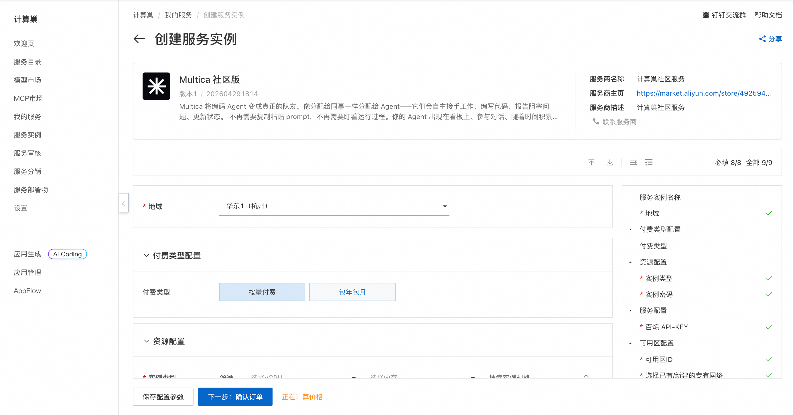
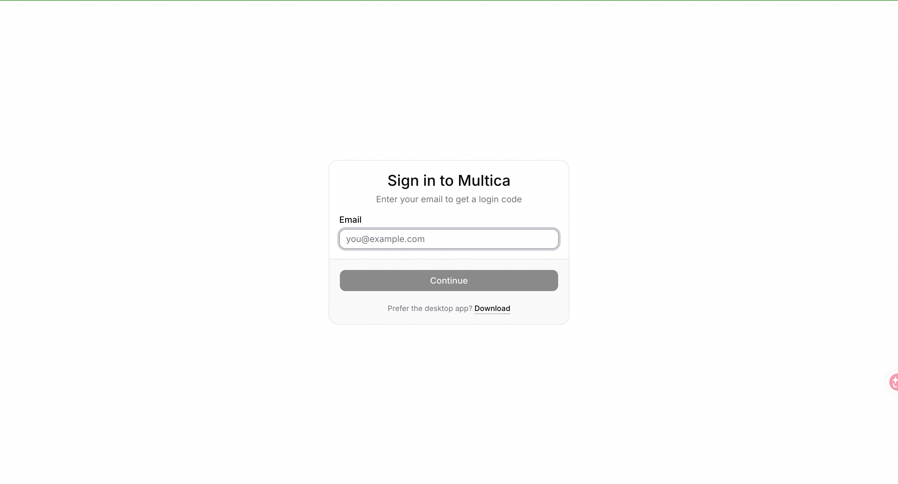
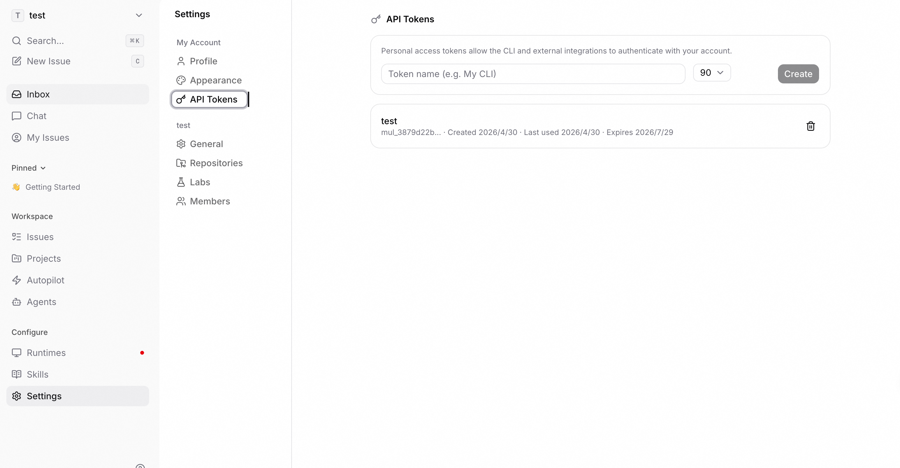
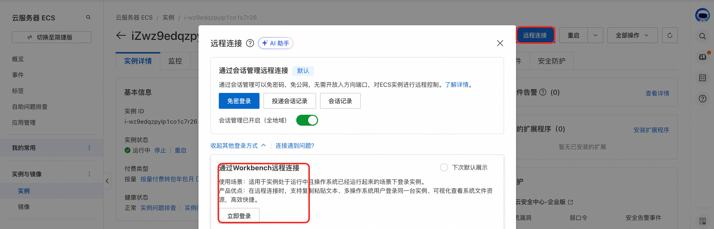
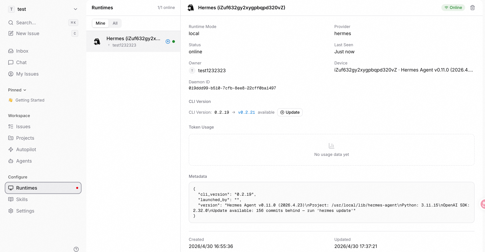
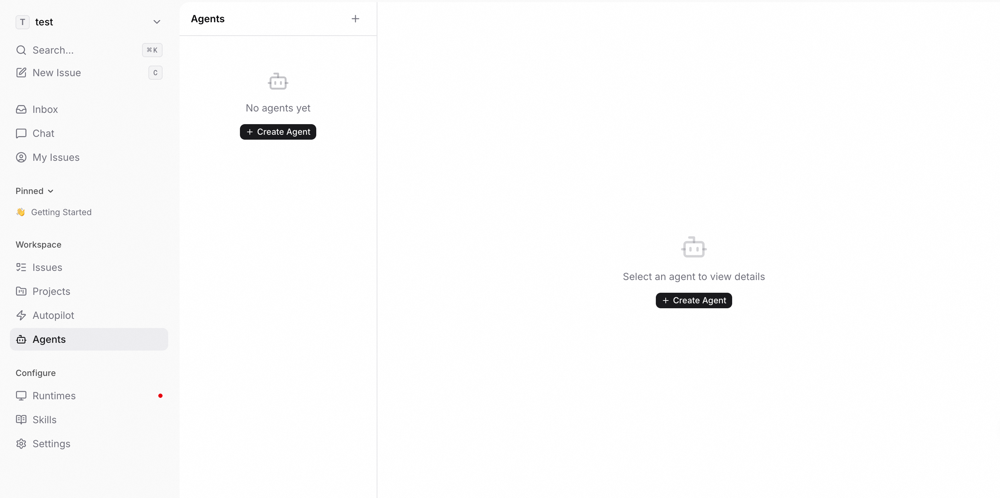
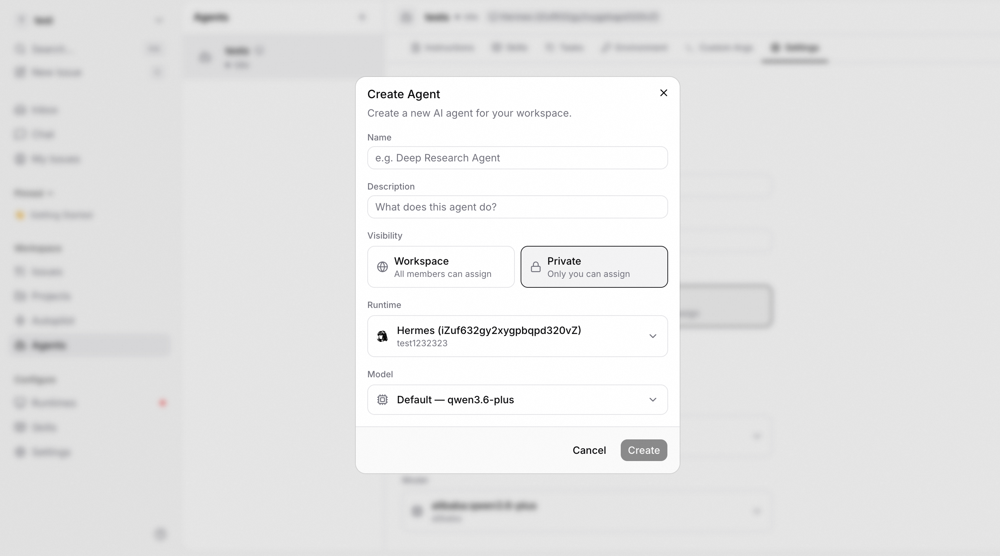
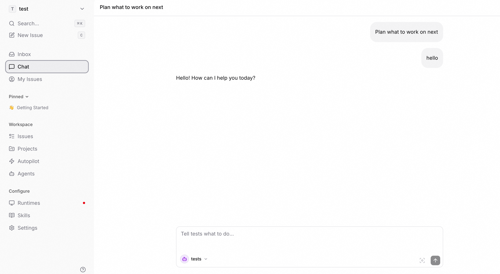

# 🤖 MultiCA 服务简介

2026年5月，MultiCA Consortium 重磅推出 MultiCA —— 一款革命性的多智能体协作开源平台。
告别单一大模型的局限，MultiCA 运行于你的私有集群，支持动态组建专家智能体网络。它能自主拆解复杂任务，协调多个专用 Agent 并行工作，并在任务完成后自动汇总结果与优化协作策略。
一次部署，无限扩展。MultiCA，让智能体学会团队合作。

## 🚀 部署流程

1. 访问计算巢 MultiCA
   社区版 [部署链接](https://computenest.console.aliyun.com/service/instance/create/cn-hangzhou?type=user&ServiceId=service-b60754b46a734871b646)，按页面提示填写部署参数：  
   

2. 参数配置完成后，系统将自动生成**费用预估明细**。确认无误后点击 **下一步：确认订单**。

3. 在订单确认页，核对实例信息与费用，点击 **立即创建** 开始自动部署。

4. 部署完成后通过安全代理访问WebUI。输入邮箱 和 验证码（88888）登录控制台。 
   

5. 点击 Settings 进入设置页面。点击 API TOKENS 创建 API TOKEN。
   

6. 点击 资源>资源ID>ECS详情页>远程连接>通过Workbench远程连接 ECS：
   

7. 执行命令配置 MultiCA CLI：
   ```shell
   sudo su root
   multica setup &
   multica config set server_url http://localhost:8080
   multica login --token # 输入上一部创建的 API TOKEN
   multica daemon start
   ```
8. 刷新页面，进入 MultiCA 控制台, 点击Runtimes 可以看到已存在的 Hermes Runtime。
   

9. 创建Agent，模型选择默认模型：
   
   

10. 切换到Chat页面选择Agent 进行交互。
   

## 📚 使用指南

更多功能请参考 MultiCA [官方文档](https://multica.ai/docs) 。
